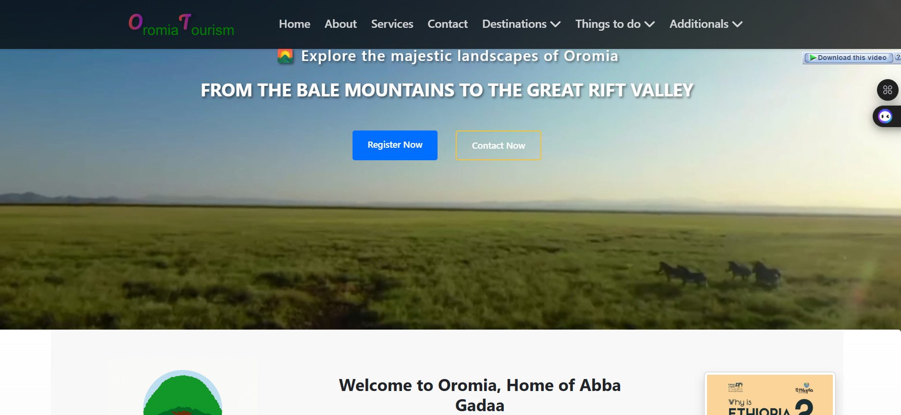
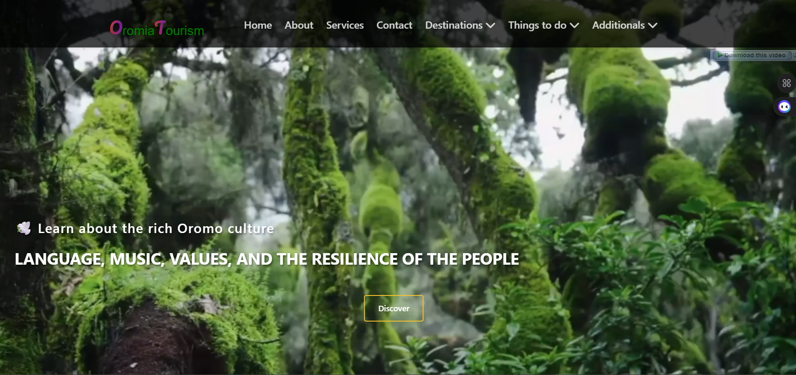
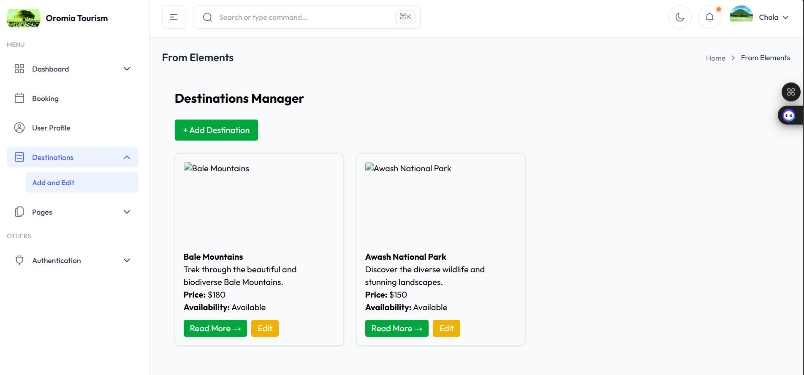
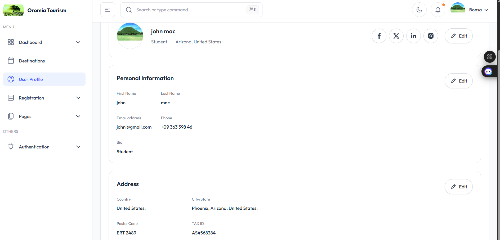
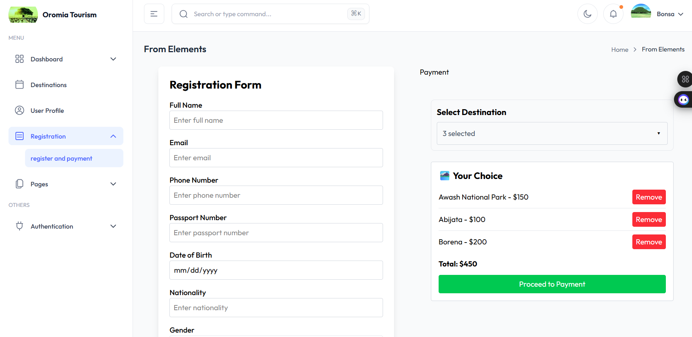
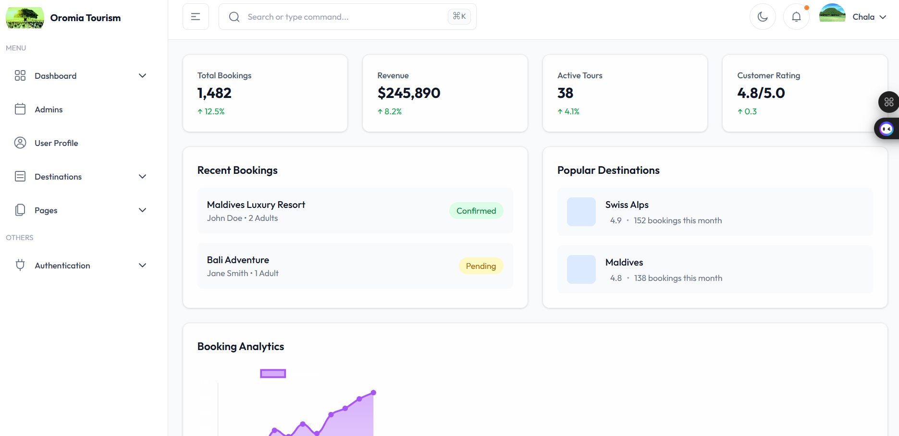

# 🌍 Oromia Tourism

**Oromia Tourism** is a comprehensive Oromia tourism and booking platform designed to revolutionize how travelers discover and experience Oromia.  
It provides **detailed destination insights, cultural knowledge, secure bookings, and multi-level administration**.

This platform bridges the gap between tourists and Oromia travel services through a **modern, interactive, and reliable web interface**.  
Users can explore the rich heritage, landscapes, and hospitality of Oromia seamlessly.

---

## 📌 Table of Contents
- [Project Overview](#project-overview)
- [Key Objectives](#key-objectives)
- [Features](#features)
- [User Flow](#user-flow)
- [Admin System](#admin-system)
- [Booking & Payment](#booking--payment)
- [Technologies Used](#technologies-used)
- [System Architecture](#system-architecture)
- [Setup Instructions](#setup-instructions)
- [Usage](#usage)
- [Environment Variables](#environment-variables)
- [Future Improvements](#future-improvements)
- [Contributing](#contributing)
- [License](#license)
- [Contact](#contact)

---

## 📖 Project Overview

Oromia, known for its **diverse cultures, ancient civilizations, and breathtaking landscapes**, is a top destination for world travelers.  
Despite this richness, tourists often face challenges such as:
- Limited access to reliable information.  
- Difficulty booking trusted services.  
- Navigating local customs and cultural nuances.

**OromiaTourism** addresses these issues by providing:
- **Destination Pages**: Detailed history, attractions, cultural highlights, and interactive maps.  
- **Booking Management**: User, Admin Zone, and General Admin coordination for seamless bookings.  
- **Cultural Insights**: Information on music, food, films, and traditional dress.  
- **Payment Integration**: Secure payment gateway via Chapa API.  
- **Role-based Administration**: Ensures reliable and transparent service delivery.

🖼️ Example Screenshot:  
<p align="center">
  
  
  
</p>

---

## 🎯 Key Objectives

- Offer a **one-stop platform** for Ethiopian tourism.  
- Enable **secure, transparent bookings** with admin oversight.  
- Provide **insightful cultural information** to enrich traveler experiences.  
- Facilitate **role-based administration** for effective system management.  
- Build a **scalable platform** using TypeScript and the MERN stack.  
- Ensure **mobile responsiveness** and fast-loading pages for all users.

---

## ✨ Features

### 🌍 Destination Pages
- Historical and cultural background.  
- Top attractions and landmarks.  
- Hotels, restaurants, and accommodations.  
- Local culture, traditions, and events.  
- Google Maps integration.  
- Interactive galleries of images and videos.

🖼️ Example:  
<p align="center">
  
  
  
</p>

---

### 👤 User Features
- Secure registration and login.  
- Profile management (edit/update personal info).  
- Explore destinations and compare prices.  
- Book trips securely with **Chapa payment integration**.  
- Track booking history and approval status.  
- Receive notifications for upcoming trips and promotions.

🖼️ Example:  
<p align="center">
  
  
  
</p>

---

## 🛠️ Admin System

### 🔹 Admin Zone
- Each Admin Zone has a unique ID.  
- Add, edit, and delete destinations.  
- Approve or reject user booking requests.  
- Manage local accommodations and cultural insights.  
- Monitor bookings and payment statuses within the zone.

🖼️ Example:  
<p align="center">
  
  
  
</p>

### 🔹 General Admin
- Controls all Admin Zones.  
- Add, edit, or delete Admin Zone accounts.  
- Supervise all bookings and payment approvals.  
- Maintain system integrity and monitor analytics.

🖼️ Example:  
<p align="center">
  
  
  
</p>

---

## 🔄 User Flow

1. **Homepage** → Explore destinations in Oromia.  
2. **Login / Register** → Create an account.  
3. **Browse Destinations** → View attractions, hotels, and pricing.  
4. **Booking** → Submit trip requests.  
5. **Admin Zone Review** → Approve or reject requests.  
6. **General Admin Supervision** → Ensure process integrity.  
7. **Payment** → Complete booking via Chapa API.  
8. **Trip Confirmed!** 🎉

🖼️ Example Flowchart:  
<p align="center">
  
  
</p>

---

## 💳 Booking & Payment

- Secure integration with **Chapa Payment Gateway**.  
- Payment verification before final confirmation.  
- Admin validation of payment proofs.  
- Users can track payment and booking status in real-time.

🖼️ Example:  
<p align="center">
  
  
</p>

---

## 🛠️ Technologies Used

### **Frontend**
- React + Vite  
- TypeScript  
- Tailwind CSS (modern responsive UI)

### **Backend**
- Node.js  
- Express.js  
- MongoDB (Mongoose ODM)

### **Tools**
- Nodemon (auto backend restart)  
- dotenv (environment variable management)  
- Chapa API (secure payments)

---

## 🏗️ System Architecture

```plaintext
                ┌─────────────┐
                │   Frontend  │
                │ React + TS  │
                └──────┬──────┘
                       │
             HTTP/REST APIs
                       │
                ┌──────┴──────┐
                │   Backend   │
                │ Node + Exp  │
                └──────┬──────┘
                       │
                 MongoDB Atlas
          (Data persistence and storage)
