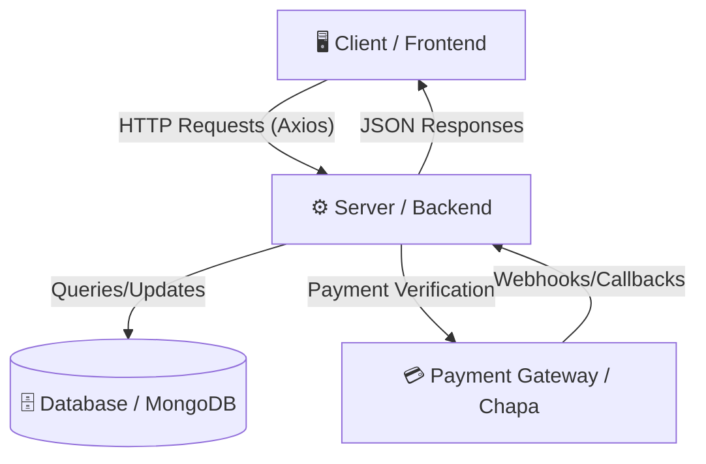
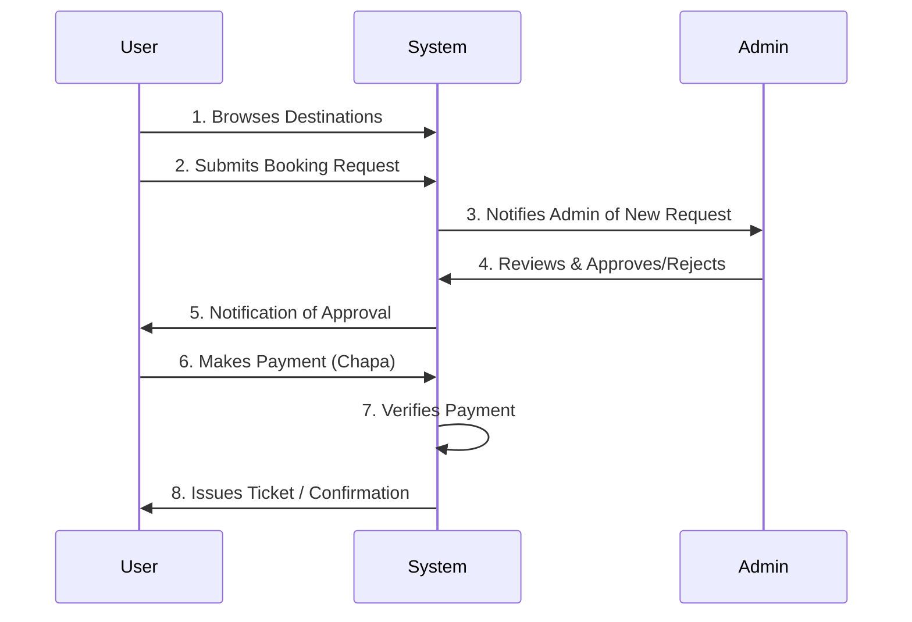

# 🌍 Oromia Tourism

[](https://opensource.org/licenses/MIT)
[](https://reactjs.org/)
[](https://nodejs.org/)
[](https://www.mongodb.com/)
[](https://chapa.co/)

**Oromia Tourism** is a comprehensive digital ecosystem designed to revolutionize the travel experience in Oromia. It acts as a bridge between the rich cultural heritage of the region and global travelers, offering a seamless, secure, and interactive platform for discovery and booking.

---

## 📌 Table of Contents

- [📖 Project Overview](#-project-overview)
- [✨ Features](#-features)
- [🧩 System Architecture](#-system-architecture)
- [🔄 User Flow & User Stories](#-user-flow--user-stories)
- [🛠️ Tech Stack](#-tech-stack)
- [🚀 Setup & Installation](#-setup--installation)
- [💳 Booking & Payments](#-booking--payments)
- [🛡️ Administration](#-administration)
- [🤝 Contributing](#-contributing)
- [📬 Contact](#-contact)

---

## 📖 Project Overview

Oromia offers diverse cultures, ancient civilizations, and breathtaking landscapes. However, the tourism sector has historically faced challenges in digital accessibility. **OromiaTourism** solves this by providing:

1.  **Centralized Discovery**: A single source of truth for destinations like Bale Mountains, Sof Omar Caves, and Wenchi Crater Lake.
2.  **Trust & Security**: Verified admin-managed listings and secure payment processing.
3.  **Cultural Immersion**: Beyond just places, we showcase the *soul* of Oromia—its food, music, films, and traditions.

---

## ✨ Features

### 🌍 Destination Exploration
*   **Interactive Maps**: Integrated Google Maps for precise location tracking.
*   **Rich Media**: High-quality image galleries and video tours.
*   **Deep Insights**: Historical context, best times to visit, and local guides.

### 👤 User-Centric Design
*   **Smart Booking Engine**: Real-time availability checks and instant booking requests.
*   **Personalized Dashboard**: Track booking status, view history, and manage profile settings.
*   **Secure Transactions**: Integrated **Chapa** payment gateway for safe, verifiable transactions.

### 🛡️ Multi-Level Administration
*   **Zone Admins**: Managed specific regions (e.g., Bale Zone Admin manages only Bale resources).
*   **General Admin**: Superuser with oversight of all zones, users, and system analytics.

---

## 🧩 System Architecture

The project follows a **Client-Server Architecture** decoupled via RESTful APIs.


```mermaid
graph TD
    Client[🖥️ Client / Frontend]
    Server[⚙️ Server / Backend]
    DB[(🗄️ Database / MongoDB)]
    Payment[💳 Payment Gateway / Chapa]

    Client -- HTTP Requests (Axios) --> Server
    Server -- Queries/Updates --> DB
    Server -- Payment Verification --> Payment
    Payment -- Webhooks/Callbacks --> Server
    Server -- JSON Responses --> Client
```

### Key Components:
-   **Frontend**: Built with React and Vite for blazing fast performance. Uses Tailwind CSS for a modern, responsive UI.
-   **Backend**: Node.js/Express REST API handling business logic, authentication (JWT), and data validation.
-   **Database**: MongoDB Atlas for flexible schema design, storing users, destinations, and booking records.

---

## 🔄 User Flow & User Stories

The platform supports three distinct user roles, each with a tailored workflow.


```mermaid
sequenceDiagram
    participant User
    participant System
    participant Admin
    
    User->>System: 1. Browses Destinations
    User->>System: 2. Submits Booking Request
    System->>Admin: 3. Notifies Admin of New Request
    Admin->>System: 4. Reviews & Approves/Rejects
    System->>User: 5. Notification of Approval
    User->>System: 6. Makes Payment (Chapa)
    System->>System: 7. Verifies Payment
    System->>User: 8. Issues Ticket / Confirmation
```

### 👤 The Traveler
> "As a traveler, I want to explore cultural sites and book a verified guide so that I can have a safe and authentic experience."

### 👮 The Zone Admin
> "As a Zone Admin, I want to manage listings in my specific region and approve bookings so that I can ensure quality control."

### 👨‍💻 The General Admin
> "As a General Admin, I want to oversee the entire system health and manage other admins to ensure platform stability."

---

## 🛠️ Tech Stack

| Component | Technology | Description |
| :--- | :--- | :--- |
| **Frontend** |  | Component-based UI library |
| **Build Tool** |  | Next-generation frontend tooling |
| **Styling** |  | Utility-first CSS framework |
| **Backend** |  | Javascript runtime environment |
| **Framework** |  | Web framework for Node.js |
| **Database** |  | NoSQL database |

---

## 🚀 Setup & Installation

Follow these "smart" steps to get the application running locally in minutes.

### Prerequisites
- Node.js (v16+)
- MongoDB Atlas Account or Local MongoDB

### 1. Clone the Repository
```bash
git clone https://github.com/Wakjira-Tesama/OromiaTourism.git
cd OromiaTourism
```

### 2. Frontend Setup
```bash
cd frontend
npm install
npm run dev
```

### 3. Backend Setup
```bash
cd backend
npm install
# Create .env file with:
# PORT=4000
# MONGO_URI=your_mongodb_connection_string
# CHAPA_SECRET_KEY=your_chapa_key
npm start
```

---

## 💳 Booking & Payments

We use **Smart Payment Verification**.
1.  User initiates booking.
2.  Admin approves booking based on availability.
3.  User pays via Chapa (mobile money/cards).
4.  **Backend Webhook** automatically verifies the transaction ID with Chapa servers before confirming the booking status in the database. This prevents fake payment slips.

---

## 🛡️ Administration

The system is designed with a hierarchy of trust:
1.  **GenAdmin**: The root operator. Can create Zone Admins.
2.  **ZoneAdmin**: Restricted scope. Can only edit content for their assigned geographic zone (e.g., "Bale Zone").

---

## 🤝 Contributing

We welcome contributions! Please see our [CONTRIBUTING.md](CONTRIBUTING.md) for details on:
1.  Forking the repo
2.  Creating feature branches (`git checkout -b feature/AmazingFeature`)
3.  Committing changes (`git commit -m 'Add some AmazingFeature'`)
4.  Pushing to the branch (`git push origin feature/AmazingFeature`)
5.  Opening a Pull Request

---

## 📬 Contact

**Wakjira Tesama Abdisa**  
Full Stack Developer | Visionary Tech Enthusiast

[](https://www.linkedin.com/in/wakjira-tesama/)
[](https://github.com/Wakjira-Tesama)
📧 Email: [wakjiratesama@gmail.com](mailto:wakjiratesama@gmail.com)
