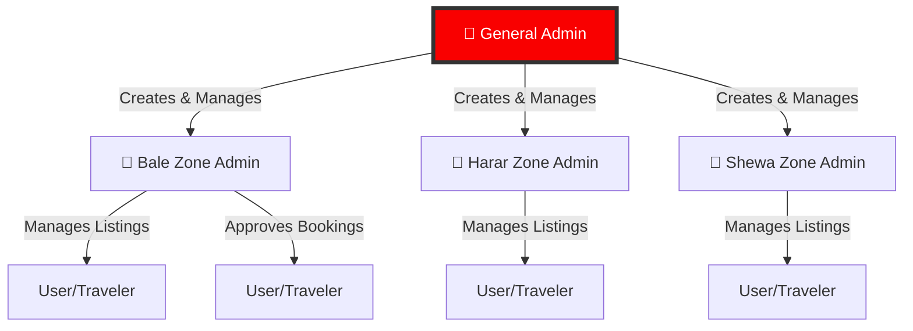
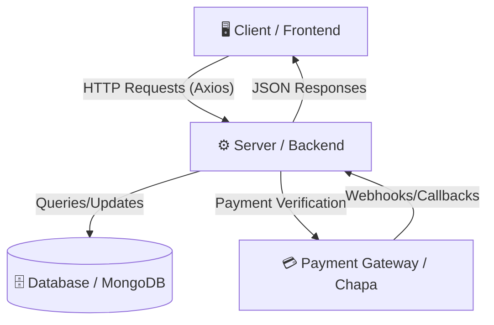
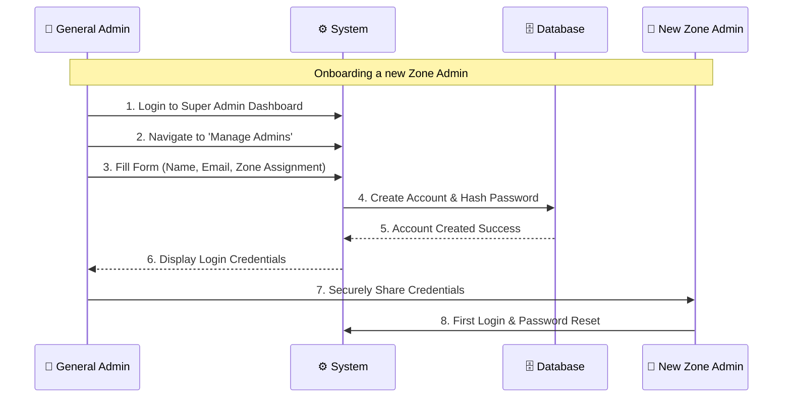
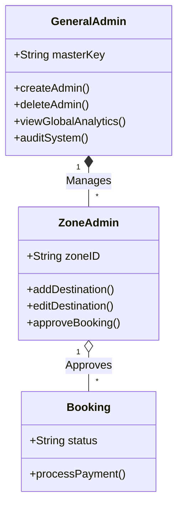

# 🌍 Oromia Tourism

[](https://opensource.org/licenses/MIT)
[](https://reactjs.org/)
[](https://nodejs.org/)
[](https://www.mongodb.com/)
[](https://github.com/Wakjira-Tesama)

**Oromia Tourism** is a comprehensive digital ecosystem designed to revolutionize the travel experience in Oromia. It uniquely features a **Multi-Tiered Administration System**, empowering a General Admin to orchestrate the entire platform while delegating regional management to Zone Admins.

---

## 📌 Table of Contents

- [📖 Project Overview](#-project-overview)
- [👑 General Admin & Hierarchy](#-general-admin--hierarchy)
- [✨ Features](#-features)
- [🧩 System Architecture](#-system-architecture)
- [📊 Admin Workflows & structure](#-admin-workflows--structure)
- [🔄 User Flow](#-user-flow)
- [🛠️ Tech Stack](#-tech-stack)
- [🚀 Setup & Installation](#-setup--installation)
- [💳 Booking & Payments](#-booking--payments)
- [🤝 Contributing](#-contributing)
- [📬 Contact](#-contact)

---

## 📖 Project Overview

Oromia offers diverse cultures, ancient civilizations, and breathtaking landscapes. **OromiaTourism** digitizes this experience by providing:

1.  **Centralized Discovery**: A single source of truth for destinations.
2.  **Trust & Security**: Verified admin-managed listings and secure payment processing.
3.  **Governance**: A structured admin system that ensures accountability at both the regional and federal levels.

---

## 👑 General Admin & Hierarchy

The **General Admin** is the superuser and backbone of the Oromia Tourism platform. This role possesses the highest level of authority and is responsible for the system's overall integrity.

### 🔑 Core Responsibilities
*   **👨‍💼 Admin Management**: capabilities to **Add, Edit, and Delete** Zone Admin accounts.
*   **🌍 Zone Oversight**: Monitor performance and listings of all specific zones (e.g., Bale, Shewa, Harar).
*   **📈 Global Analytics**: View total revenue, total bookings, and user growth across *all* zones.
*   **🛡️ Security Control**: Manage access controls and system-wide settings.

### 🏛️ Organizational Structure Diagram

The platform uses a hierarchical structure to maintain order and scalability.


```mermaid
graph TD
    GA[👑 General Admin]
    style GA fill:#f90000,stroke:#333,stroke-width:4px,color:white
    
    ZA1[👤 Bale Zone Admin]
    ZA2[👤 Harar Zone Admin]
    ZA3[👤 Shewa Zone Admin]
    
    U1[User/Traveler]
    U2[User/Traveler]
    U3[User/Traveler]
    U4[User/Traveler]

    GA -->|Creates & Manages| ZA1
    GA -->|Creates & Manages| ZA2
    GA -->|Creates & Manages| ZA3
    
    ZA1 -->|Manages Listings| U1
    ZA1 -->|Approves Bookings| U2
    ZA2 -->|Manages Listings| U3
    ZA3 -->|Manages Listings| U4
```

---

## ✨ Features

### 🌍 For Travelers
*   **Interactive Maps**: Integrated Google Maps for precise location tracking.
*   **Rich Media**: High-quality image galleries and video tours.
*   **Smart Booking**: Real-time availability checks and instant booking requests.

### 🛡️ For General Admin (Superuser)
*   **Dashboard Overview**: A command center showing the health of the entire system.
*   **User Management**: Ability to ban/unban users involved in fraudulent activities.
*   **Financial Reports**: Aggregated view of payments processed via Chapa.

### 👤 For Zone Admins
*   **Regional Control**: Can only edit/delete destinations within their assigned zone.
*   **Booking Approvals**: First-line reviewers for trip requests in their area.

---

## 🧩 System Architecture

The project follows a **Client-Server Architecture** decoupled via RESTful APIs.


```mermaid
graph TD
    Client[🖥️ Client / Frontend]
    Server[⚙️ Server / Backend]
    DB[(🗄️ Database / MongoDB)]
    Payment[💳 Payment Gateway / Chapa]

    Client -- HTTP Requests (Axios) --> Server
    Server -- Queries/Updates --> DB
    Server -- Payment Verification --> Payment
    Payment -- Webhooks/Callbacks --> Server
    Server -- JSON Responses --> Client
```

---

## 📊 Admin Workflows & structure

### 1. Admin Creation Workflow
How the General Admin scales the team by adding new Zone Admins.


```mermaid
sequenceDiagram
    participant GA as 👑 General Admin
    participant Sys as ⚙️ System
    participant DB as 🗄️ Database
    participant ZA as 👤 New Zone Admin

    Note over GA, ZA: Onboarding a new Zone Admin
    GA->>Sys: 1. Login to Super Admin Dashboard
    GA->>Sys: 2. Navigate to 'Manage Admins'
    GA->>Sys: 3. Fill Form (Name, Email, Zone Assignment)
    Sys->>DB: 4. Create Account & Hash Password
    DB-->>Sys: 5. Account Created Success
    Sys-->>GA: 6. Display Login Credentials
    GA->>ZA: 7. Securely Share Credentials
    ZA->>Sys: 8. First Login & Password Reset
```

### 2. Global Management Structure
The General Admin has a holistic view of the system components.


```mermaid
classDiagram
    class GeneralAdmin {
        +String masterKey
        +createAdmin()
        +deleteAdmin()
        +viewGlobalAnalytics()
        +auditSystem()
    }

    class ZoneAdmin {
        +String zoneID
        +addDestination()
        +editDestination()
        +approveBooking()
    }

    class Booking {
        +String status
        +processPayment()
    }

    GeneralAdmin "1" *-- "*" ZoneAdmin : Manages
    ZoneAdmin "1" o-- "*" Booking : Approves
```

---

## 🔄 User Flow

1.  **Homepage**: User lands on the main portal.
2.  **Discovery**: Browses destinations (filtered by zone).
3.  **Booking**: Submits a request.
4.  **Admin Review**: 
    *   *Zone Admin* receives the request.
    *   *Zone Admin* approves based on availability.
5.  **Payment**: User pays via Chapa.
6.  **Confirmation**: Ticket issued.
7.  **Gen Admin Review**: The General Admin can see this transaction in the global logs for audit purposes.

---

## 🛠️ Tech Stack

| Component | Technology | Description |
| :--- | :--- | :--- |
| **Frontend** |  | Component-based UI library |
| **Styling** |  | Utility-first CSS framework |
| **Backend** |  | Javascript runtime environment |
| **Database** |  | NoSQL database |

---

## 🚀 Setup & Installation

### Prerequisites
- Node.js (v16+)
- MongoDB Atlas Account or Local MongoDB

### 1. Clone the Repository
```bash
git clone https://github.com/Wakjira-Tesama/OromiaTourism.git
cd OromiaTourism
```

### 2. Frontend Setup
```bash
cd frontend
npm install
npm run dev
```

### 3. Backend Setup
```bash
cd backend
npm install
# Create .env file with:
# JWT_SECRET=super_secret_key_for_gen_admin
# PORT=4000
npm start
```

---

## 🤝 Contributing

We welcome contributions! Please see our [CONTRIBUTING.md](CONTRIBUTING.md) for details.

---

## 📬 Contact

**Wakjira Tesama Abdisa**  
Full Stack Developer | Visionary Tech Enthusiast

[](https://www.linkedin.com/in/wakjira-tesama/)
[](https://github.com/Wakjira-Tesama)
📧 Email: [wakjiratesama@gmail.com](mailto:wakjiratesama@gmail.com)
